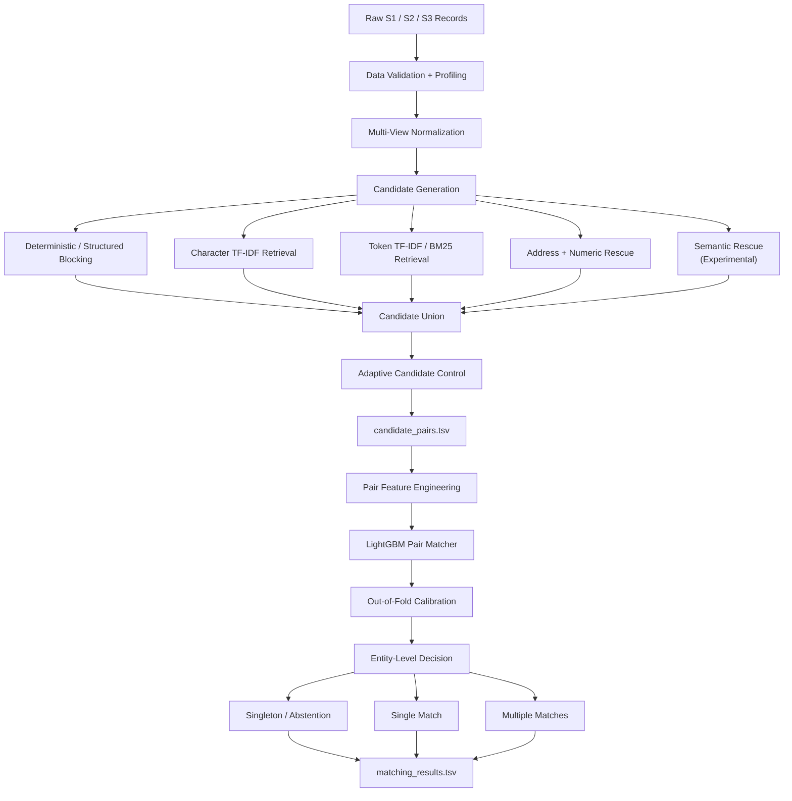
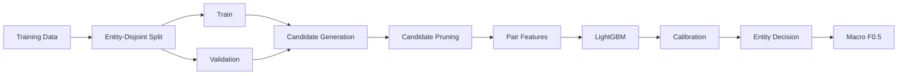

# Amazon Business Entity Resolution Challenge

Team implementation for the **Amazon Business Entity Resolution Challenge**.

This repository contains our machine-learning pipeline for resolving noisy business records across three independent sources.

The project is designed around three objectives:

1. **High matching quality** measured by macro F₀.₅.
2. **High candidate recall with small candidate sets**.
3. **A reproducible, leakage-safe, competition-compliant pipeline**.

---

# 1. Problem Statement

Business identity data can arrive from multiple independent sources.

The same real-world business may appear differently across sources because of:

- abbreviations
- legal suffix variations
- typos
- punctuation differences
- word-order changes
- transliteration
- partial addresses
- address abbreviations
- missing address components
- landmark-based addresses
- municipal numbering variations

There is no common business identifier shared across all sources.

The challenge is to determine which records refer to the same real-world business entity.

## Sources

```text
Source 1
    ↓
Deduplicated reference source

Source 2
    ↓
Noisy business records

Source 3
    ↓
Noisy business records
````

For every Source 1 entity, the system must identify:

```text
0 matches
1 match
or
multiple matches
```

The task is therefore an **entity-resolution / record-linkage problem**, not a standard single-label classification problem.

---

# 2. Input Schema

Each source contains:

```text
entity_id
business_name
business_address
country
```

The source is identified by the `entity_id` prefix:

```text
S1-xxxxx → Source 1
S2-xxxxx → Source 2
S3-xxxxx → Source 3
```

There is no separate `source` column.

## Business Name Noise

Expected variations include:

```text
Corp                  ↔ Corporation
Pvt Ltd               ↔ Private Limited
ABC & Sons            ↔ ABC and Sons
ABC Technologies      ↔ ABC Tech
```

along with:

* spelling errors
* punctuation changes
* token reordering
* transliteration
* trade-name / legal-name variations

## Address Noise

Expected variations include:

```text
Road                  ↔ Rd
Street                ↔ St
```

and:

* missing components
* reordered components
* transliteration
* landmark-based descriptions
* municipal numbering differences
* partial addresses

---

# 3. Dataset Structure

The official challenge resource is organized as:

```text
student_resource/
│
├── dataset/
│   │
│   ├── train/
│   │   ├── train_source1.tsv
│   │   ├── train_source2.tsv
│   │   ├── train_source3.tsv
│   │   └── train_ground_truth.tsv
│   │
│   └── test/
│       ├── test_source1.tsv
│       ├── test_source2.tsv
│       └── test_source3.tsv
│
├── utils/
│   └── validate_submission.py
│
├── README.md
└── Documentation_template.md
```

## Training files

### `train_source1.tsv`

Deduplicated Source 1 reference records.

### `train_source2.tsv`

Source 2 training records.

### `train_source3.tsv`

Source 3 training records.

### `train_ground_truth.tsv`

Ground-truth matches:

```text
source1_entity_id
matched_entity_ids
```

The `matched_entity_ids` field contains a comma-separated list of matching S2/S3 entity IDs.

An empty value represents an S1 entity with no matching S2/S3 records.

## Test files

```text
test_source1.tsv
test_source2.tsv
test_source3.tsv
```

The test set contains no ground-truth labels.

Predictions must be generated for **every Source 1 test entity**.

---

# 4. Important Challenge Constraints

## TSV Format

All challenge files are tab-separated.

Example:

```python
import pandas as pd

df = pd.read_csv(
    "student_resource/dataset/train/train_source1.tsv",
    sep="\t"
)
```

The pipeline must preserve the official TSV schemas.

---

## Open-Set Country Handling

Training contains:

```text
US
India
```

The test set additionally contains:

```text
France
```

Therefore the pipeline must treat `country` as an **open-set string field**.

We must not:

```text
hard-code {US, India}
```

or reject unknown countries.

The normalization and model must continue to work when a new country appears.

---

# 5. External Data / API Restriction

The challenge prohibits external business identity lookup.

The pipeline must NOT use:

* commercial Entity Resolution APIs
* business lookup services
* government business-registration databases
* geocoding APIs
* external business databases
* internet-based business identity lookup
* external data augmentation

The actual entity-resolution system operates using:

```text
Provided training data
+
Provided test data
+
Permitted local algorithms/models
```

No external business information is used.

---

# 6. Model Restrictions

The final model must comply with the challenge requirement of:

```text
MIT or Apache 2.0 compatible model
≤ 8 Billion parameters
```

For any pretrained model that is introduced later, the **exact checkpoint license** must be verified.

The library license and model-weight license must not be confused.

---

# 7. Evaluation Metric

The official metric is:

$$
F_{0.5}
=
\frac{1.25 \times Precision \times Recall}
{0.25 \times Precision + Recall}
$$

The calculation is performed:

```text
for each Source 1 entity
        ↓
calculate F0.5
        ↓
macro-average across Source 1 entities
```

The metric is precision-heavy.

False merges are therefore particularly costly.

---

# 8. Singleton Handling

A singleton is a Source 1 entity with no true Source 2 or Source 3 matches.

Correct output:

```text
S1-00001    <empty>
```

A correctly identified singleton receives full per-entity credit.

Predicting a false match for a true singleton produces zero for that entity.

Therefore singleton detection is a **first-class part of the final decision layer**.

---

# 9. Core System Philosophy

The project does not rely on a single similarity method.

Instead, the system separates entity resolution into three stages:

```text
                    SOURCE 1 RECORD
                           │
                           ▼
                 ┌─────────────────────┐
                 │ CANDIDATE GENERATION│
                 │                     │
                 │ "What could match?" │
                 └──────────┬──────────┘
                            │
                            ▼
                    CANDIDATE PAIRS
                            │
                            ▼
                 ┌─────────────────────┐
                 │   PAIR MATCHING     │
                 │                     │
                 │ "Are they the same?"│
                 └──────────┬──────────┘
                            │
                            ▼
                ┌──────────────────────┐
                │ ENTITY-LEVEL DECISION│
                │                      │
                │ 0 / 1 / MANY matches │
                └──────────┬───────────┘
                           │
                           ▼
                    FINAL OUTPUT
```

The central principle is:

> **Semantic similarity suggests relevance; identity requires multiple pieces of evidence.**

Therefore the system combines:

```text
STRUCTURAL EVIDENCE
        +
LEXICAL EVIDENCE
        +
OPTIONAL SEMANTIC EVIDENCE
        +
SUPERVISED PAIR MATCHING
        +
F0.5-AWARE DECISIONING
```

---

# 10. Complete System Architecture



---

# 11. Stage A — Candidate Generation

Candidate generation is treated as a first-class optimization problem.

The target is:

```text
HIGH CANDIDATE RECALL
+
SMALL CANDIDATE SET
```

A true match that is removed during candidate generation cannot be recovered by the final matcher.

Therefore we track:

```text
Candidate Recall
Mean Candidates / S1
Median Candidates / S1
P95 Candidates / S1
P99 Candidates / S1
Reduction Ratio
```

---

# 12. Multi-View Normalization

The raw fields are preserved.

We do not overwrite the source values with one canonical representation.

## Name representations

Possible representations include:

```text
raw
Unicode-normalized
lowercase
compact
alphanumeric
tokenized
character representation
legal-suffix-reduced
numeric-related signatures
```

## Address representations

Possible representations include:

```text
raw normalized
compact
alphanumeric
tokenized
character representation
numeric tokens
number/address signatures
```

## Country

Country is normalized while retaining its original semantic value.

Unknown countries are supported automatically.

---

# 13. Deterministic / Structured Blocking

Deterministic blocking captures high-confidence candidates cheaply.

Potential blocks include:

```text
exact normalized name
exact core name
rare informative name tokens
name + numeric evidence
address signatures
address number + informative token
name + address combinations
rare character signatures
```

Common generic tokens should not create unnecessarily large candidate sets.

Rarity is therefore considered where appropriate.

---

# 14. Character-Level TF-IDF Retrieval

Character n-gram TF-IDF is one of the main lexical retrieval mechanisms.

Initial implementation:

```text
TF-IDF
+
character n-grams
```

Typical initial range:

```text
3–5 grams
```

subject to validation.

Character-level retrieval helps handle:

* spelling errors
* abbreviations
* punctuation changes
* partial strings
* formatting variation
* word-order noise
* OCR-like corruption

Possible retrieval views:

```text
business_name
business_address
name + address
```

---

# 15. Token-Level Retrieval

Token retrieval provides another independent view.

Potential methods:

```text
token TF-IDF
BM25-style retrieval
```

This can help recover:

* token overlap
* reordered words
* partial name matches
* address token matches
* longer noisy strings

The final choice between retrieval mechanisms is determined experimentally.

---

# 16. Address and Numeric Rescue

Business names can be noisy while addresses contain strong identity evidence.

Potential signals:

```text
house/building number
unit/shop/floor number
postal-like tokens
number overlap
address token overlap
address character similarity
```

Numeric differences are not always absolute contradictions because addresses can be incomplete or formatted differently.

Therefore numeric evidence is used as model features and compatibility signals rather than blindly applied as a hard rule.

---

# 17. Semantic Retrieval

Our original semantic approach remains part of the overall strategy, but as a **candidate-recall/rescue mechanism**, not as the sole identity decision.

Conceptually:

```text
Record
   ↓
Multilingual embedding
   ↓
Vector retrieval
   ↓
Additional candidates
   ↓
Candidate union
```

Potential implementation options include:

```text
small multilingual bi-encoder
BGE-family model
exact nearest-neighbour search
FAISS / HNSW
```

These are experimental components.

They should only remain in the final pipeline if validation demonstrates:

```text
meaningful candidate recall gain
+
acceptable candidate growth
+
acceptable runtime
```

Semantic similarity is never treated as sufficient proof of entity identity.

---

# 18. Candidate Union

Candidates from independent retrieval channels are combined:

```text
Deterministic blocks
        +
Character TF-IDF
        +
Token TF-IDF / BM25
        +
Address / numeric retrieval
        +
Semantic rescue
```

Duplicate IDs are removed.

Internally we preserve:

```text
channel
rank
retrieval score
block provenance
```

because these can become features for the final matcher.

---

# 19. Adaptive Candidate Control

A fixed large `K` is not used blindly.

Candidate budget should depend on query quality.

Conceptually:

```text
Strong evidence
    ↓
small candidate set

Moderate evidence
    ↓
moderate candidate set

Weak/noisy evidence
    ↓
larger controlled candidate set
```

Candidate control may use:

```text
retrieval score
rank
rarity
numeric compatibility
cross-channel agreement
contradictions
field completeness
```

The final policy must be chosen using validation.

---

# 20. `candidate_pairs.tsv` Handoff

This is a critical boundary.

The exact pipeline is:

```text
Candidate Retrieval
       ↓
Candidate Union
       ↓
Candidate Pruning
       ↓
candidate_pairs.tsv
       ↓
Pair Feature Generation
       ↓
LightGBM
```

`candidate_pairs.tsv` must contain the **exact final candidate set that is passed into the matcher**.

It must not be:

* an early blocking result
* a raw ANN result
* a pre-pruning superset
* a candidate file disconnected from the matcher

Every predicted match must exist in the candidate list.

---

# 21. Stage B — Pair Feature Engineering

Each candidate pair is:

```text
(S1, S2)
```

or:

```text
(S1, S3)
```

The pair is converted into a feature vector.

---

## Name Features

Potential features:

```text
raw exact equality
normalized exact equality
core-name equality
character similarity
edit similarity
Jaro/Jaro-Winkler
token overlap
Jaccard similarity
TF-IDF cosine
semantic cosine
rare-token overlap
name length
token count
generic-name indicators
```

---

## Address Features

Potential features:

```text
normalized exact equality
character similarity
token overlap
Jaccard similarity
TF-IDF similarity
numeric-token overlap
number agreement
number contradiction
address completeness
address component similarity
semantic address similarity
```

---

## Context Features

Potential features:

```text
country agreement
target source
name missingness
address missingness
country missingness
short-name flag
name frequency
address frequency
collision count
candidate rank
retrieval channel
number of retrieval channels
cross-channel agreement
contradiction signals
```

Only useful features are retained after ablation.

---

# 22. Stage B — LightGBM Pair Matcher

The primary final pair scorer is:

```text
LightGBM
```

The model learns:

```text
P(pair represents the same entity)
```

from the engineered pair features.

The model combines:

```text
Name Evidence
+
Address Evidence
+
Numeric Evidence
+
Country
+
Missingness
+
Retrieval Evidence
+
Candidate Provenance
```

A tree-based matcher is well suited to heterogeneous numerical, categorical and similarity features.

---

# 23. Hard-Negative Training

Random negative pairs alone are insufficient.

The matcher should learn from candidates that look highly similar but refer to different businesses.

Important hard negatives:

```text
same/similar name + different address

same/similar address + different name

high lexical similarity + wrong entity

high semantic similarity + wrong entity

same blocking key + wrong entity

high model-score false positives

likely singleton false-positive candidates
```

Hard-negative mining is performed out-of-fold to avoid leakage.

---

# 24. Out-of-Fold Calibration

Raw model scores should not automatically be treated as probabilities.

The workflow is:

```text
LightGBM score
       ↓
Out-of-fold predictions
       ↓
Probability calibration
       ↓
Calibrated score
```

Initial calibration can use Platt/logistic scaling.

Thresholds are selected against the actual macro F₀.₅ metric.

A generic threshold such as:

```text
p > 0.5
```

must not be assumed to be optimal.

---

# 25. Stage C — Entity-Level Decision

The final decision is performed per Source 1 entity.

The system considers the entire candidate set for the S1 entity.

Possible outcomes:

```text
ZERO matches
ONE match
MULTIPLE matches
```

The system does not force a single best candidate.

The system does not impose a global one-to-one constraint unless the training data proves that such a constraint is valid.

---

# 26. Singleton / Abstention Decision

The final layer explicitly asks:

> Is there enough evidence to make any match?

If all candidates are weak or contradictory:

```text
predict empty
```

rather than forcing a match.

This is important because true singletons receive full per-entity credit when correctly identified.

---

# 27. Candidate-Level and Entity-Level Metrics

The project tracks multiple metrics.

## Primary

```text
Macro F0.5
```

## Candidate generation

```text
Candidate Recall
Mean Candidate Count
Median Candidate Count
P95 Candidate Count
P99 Candidate Count
Reduction Ratio
```

## Decision quality

```text
Singleton correctness
False merge rate
False positive rate
False negative rate
```

## Source-specific

```text
S1 → S2
S1 → S3
```

## Difficulty regimes

```text
Missing name
Missing address
Short names
Generic names
Numeric conflicts
Noisy names
Country variation
```

---

# 28. Validation Strategy

Validation reproduces the complete inference pipeline.



Random pair-level splitting is avoided because it can leak the same entity across training and validation.

Where applicable, positive-linked entity components are kept together.

Training-derived resources such as:

```text
TF-IDF statistics
token frequencies
retrieval indexes
hard negatives
calibration
thresholds
```

must not leak validation information.

---

# 29. Unseen-Country Robustness

France is absent from training.

Therefore an exact France validation score cannot be calculated from labeled training data.

Instead the project evaluates robustness through:

```text
train on one seen country
        ↓
validate on another
```

and through:

```text
country-agnostic normalization
missing-country tests
format variation tests
```

Country-specific rules are only introduced when justified by supplied-data experiments.

---

# 30. Experiment Strategy

The system is developed incrementally.

```text
Baseline
   ↓
Better normalization
   ↓
Better deterministic blocking
   ↓
Character TF-IDF
   ↓
Token/BM25 retrieval
   ↓
Address/numeric rescue
   ↓
Candidate pruning
   ↓
LightGBM
   ↓
Hard negatives
   ↓
Calibration
   ↓
Singleton improvements
   ↓
Semantic rescue
   ↓
Embedding fine-tuning
   ↓
Optional advanced experiments
```

Not every stage is guaranteed to remain.

A component is retained only when it demonstrates a reproducible benefit.

---

# 31. Experiment Decision Rule

Every experiment should answer:

```text
What changed?
        ↓
Why was it changed?
        ↓
What metric should improve?
        ↓
Did it actually improve?
```

Primary comparison:

```text
Macro F0.5
```

Candidate-generation comparison:

```text
Candidate Recall
+
Candidate Count
```

Decision comparison:

```text
False Merge Rate
+
Singleton Performance
```

Runtime and memory are also tracked.

---

# 32. Baseline Submission Strategy

The first complete pipeline is treated as a baseline.

Workflow:

```text
Build baseline
      ↓
Generate full test predictions
      ↓
Validate output files
      ↓
Submit matching_results.tsv
      ↓
Record leaderboard score
      ↓
Analyze errors
      ↓
Improve one major component
      ↓
Revalidate
      ↓
Generate new submission
```

The leaderboard is used as feedback, but local leakage-safe validation remains the main experiment-selection mechanism.

Do not submit every minor change.

---

# 33. Current Baseline Status

The first real full-test baseline produced a leaderboard score of:

```text
F0.5 = 0.505
```

This is the project's current reference point.

It should not be interpreted as the theoretical quality of the overall architecture.

The purpose of subsequent phases is to determine whether the main performance loss comes from:

```text
Candidate Generation
        ↓
Pair Matching
        ↓
Calibration
        ↓
Singleton / Entity Decision
```

---

# 34. Phase-Based Development

## Phase 1 — Foundation

```text
dataset inspection
metric implementation
leakage-safe validation
repository setup
```

## Phase 2 — Initial Pipeline

```text
normalization
exact blocking
lexical retrieval
candidate union
pair features
LightGBM
decision layer
```

## Phase 3 — Full-Test Baseline

```text
full S1 inference
full S2/S3 target corpus
candidate_pairs.tsv
matching_results.tsv
official validation
first leaderboard submission
```

## Phase 4+

Targeted improvements based on observed failures:

```text
Candidate recall failures
        ↓
blocking/retrieval improvement

Matcher failures
        ↓
features/hard negatives

False merges
        ↓
precision/calibration improvements

Singleton failures
        ↓
abstention/entity-level decision

Lexical misses
        ↓
semantic rescue experiments
```

---

# 35. Current Repository Structure

```text
BUSINESS_ENTITY-RESOLUTION/
│
├── README.md
├── .gitignore
│
├── docs/
│
├── experiments/
│   ├── eda.py
│   ├── run_baseline.py
│   ├── run_phase3.py
│   ├── run_phase3a_duckdb.py
│   ├── run_phase4_diagnostic.py
│   ├── run_phase4_duckdb.py
│   ├── finalize_snapshot.py
│   ├── finalize_phase4_snapshot.py
│   ├── configs/
│   ├── logs/
│   └── reports/
│
├── src/
│   ├── blocking/
│   ├── calibration/
│   ├── config/
│   ├── data/
│   ├── decision/
│   ├── evaluation/
│   ├── features/
│   ├── models/
│   ├── pipeline/
│   ├── preprocessing/
│   └── retrieval/
│
├── models/
│
├── output/
│   ├── candidate_pairs.tsv
│   └── matching_results.tsv
│
├── submissions/
│
└── student_resource/
    ├── dataset/
    │   ├── train/
    │   └── test/
    ├── utils/
    │   └── validate_submission.py
    ├── README.md
    └── Documentation_template.md
```

---

# 36. Important File Policy

The official challenge dataset is intentionally kept **out of Git history**.

Local-only:

```text
student_resource/dataset/
output/
models/
submissions/
```

These contain:

* challenge data
* generated predictions
* model artifacts
* submission snapshots

They should not be committed unless explicitly required.

The source code, documentation, configurations, tests, and experiment scripts are version controlled.

---

# 37. Official Submission Files

The live leaderboard prediction file is:

```text
output/matching_results.tsv
```

The final competition package contains:

```text
output/
├── matching_results.tsv
└── candidate_pairs.tsv
```

along with:

```text
code/business_entity_resolution/
├── src/
├── README.md
└── requirements.txt
```

and:

```text
Documentation_template.md
```

The exact final ZIP structure must follow the official challenge specification.

---

# 38. Output Validation

Before submission, execute the official validator:

```bash
python student_resource/utils/validate_submission.py \
    --matching output/matching_results.tsv \
    --candidate output/candidate_pairs.tsv \
    --test-dir student_resource/dataset/test
```

A successful result should be:

```text
PASS
```

The validator checks structural and consistency requirements.

A validator `PASS` does not mean the predictions are accurate; model quality must be evaluated separately.

---

# 39. Team Git Workflow

Do not work directly on `main`.

Use feature branches:

```text
main
 │
 ├── feature/validation
 ├── feature/normalization
 ├── feature/blocking
 ├── feature/retrieval
 ├── feature/features
 └── feature/matching
```

Typical workflow:

```bash
git checkout main
git pull

git checkout -b feature/<feature-name>

# implement changes

git add .
git commit -m "feat: <description>"
git push -u origin feature/<feature-name>
```

Then create a Pull Request:

```text
feature/<feature-name>
          ↓
        main
```

Review before merging.

---

# 40. Engineering Principles

The project follows these principles:

```text
1. Measure before adding complexity.

2. Candidate generation and matching are separate problems.

3. Candidate recall is the ceiling for downstream recall.

4. Smaller candidate sets are useful only when recall is preserved.

5. Semantic similarity is not proof of identity.

6. Hard negatives should resemble real candidate errors.

7. Macro F0.5 is the primary optimization target.

8. Singleton handling is a first-class decision.

9. Multiple matches per S1 are allowed.

10. No external business information is used.

11. Validation must be leakage-safe.

12. Every experiment must be reproducible.

13. Every architectural addition must justify itself experimentally.
```

---

# 41. Final Architecture Summary

```text
                         RAW DATA
                            │
                            ▼
                  DATA VALIDATION / EDA
                            │
                            ▼
                 MULTI-VIEW NORMALIZATION
                            │
                            ▼
              ┌────────────────────────────┐
              │    CANDIDATE GENERATION   │
              │                            │
              │  Exact / Structured       │
              │  Character TF-IDF         │
              │  Token / BM25             │
              │  Address / Numeric        │
              │  Semantic Rescue*         │
              └──────────────┬─────────────┘
                             │
                             ▼
                    CANDIDATE UNION
                             │
                             ▼
                  ADAPTIVE CANDIDATE
                       CONTROL
                             │
                             ▼
                  candidate_pairs.tsv
                             │
                             ▼
                  PAIR FEATURE ENGINE
                             │
                             ▼
                     LIGHTGBM MATCHER
                             │
                             ▼
                    OOF CALIBRATION
                             │
                             ▼
                 ENTITY-LEVEL DECISION
                             │
                  ┌──────────┼──────────┐
                  ▼          ▼          ▼
                EMPTY       ONE        MANY
                  │          │          │
                  └──────────┼──────────┘
                             ▼
                  matching_results.tsv
```

`* Semantic retrieval is an experimental/rescue component and remains in the final system only if validation demonstrates a measurable improvement.`

---

# 42. Project Goal

The final goal is to build a system that simultaneously achieves:

```text
HIGH CANDIDATE RECALL
        +
SMALL CANDIDATE SETS
        +
LOW FALSE-MERGE RATE
        +
STRONG SINGLETON HANDLING
        +
ROBUST NOISY-RECORD MATCHING
        +
HIGH MACRO F0.5
        +
REPRODUCIBLE EXECUTION
```

The project does not optimize for architectural complexity.

The objective is to systematically improve the actual competition metric through:

```text
IMPLEMENT
   ↓
MEASURE
   ↓
ANALYZE
   ↓
IMPROVE
   ↓
VALIDATE
   ↓
SUBMIT
```
